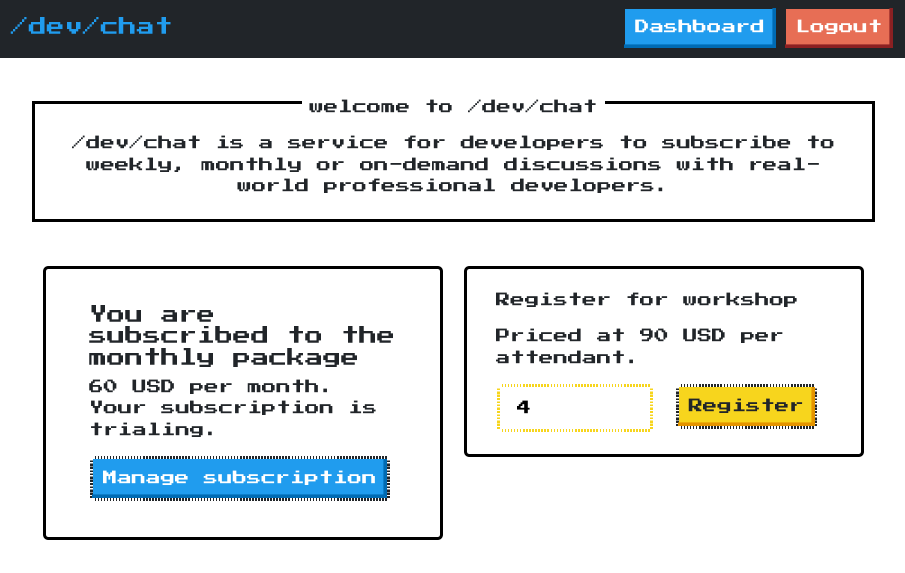

_____
>_The **Billing Integration Challenge** is modeled after a consulting engagement with a make-believe client who gives you requirements for a Stripe integration.  Follow these steps to get started:_
> 1. _Start by reading this README, taking a look at the open pull request for the first milestone, and checking out the `dev` branch._
> 2. _Search for the `TODO` comments related to the milestone, implement the requirements listed in the pull request, and then push back up to `dev`._
> 3. _Look at the comment on the pull request for feedback, then start iterating. When you pass the test suite in GitHub Actions, your branch will merge and a new pull request will open._
>
> _If you need assistance, reach out to partner-support@stripe.com._
___

 
  
You receive an email from alex@dev.chat with subject: "Stripe integration project?" 

  
   
  
  Hello!  

  I'm a freelance programmer with a number of contracts going right now, but some friends of mine recently told me that I'm good at explaining things and should consider teaching. I started building out a service for subscribing to pair coding sessions with me, but other projects ramped up and I wasn't able to finish the Stripe integration. 
  
  If you're available, then please see the attached project brief for more info about my planned implementation.

  Thanks,

  Alex

## Project Brief: Help /dev/chat collect subscriptions

`/dev/chat` is going to be a service where novice developers can subscribe to get regular pair of coding sessions with experts, starting with myself. While I have a successful freelance development business, a subscription-based offering would provide more stability to my income.  Plus, my friends say that I'm good at finding bugs and explaining things!   

I've given the site a retro 8-bit aesthetic, hopefully it makes developers feel at home:

For the underlying services, I’m leaning on 3rd party providers wherever I can.  I’m going to coordinate appointment times via email, that way I don’t need to integrate a scheduling interface.  I considered a few different payment providers, but what put me over the edge with Stripe were the ready-to-go interfaces.  They give me a fully localized checkout page, as well as a subscription management portal for my customers.  If things go really well and I start getting subscribers from other countries, then Stripe Tax will also save me some headaches.

### Deliverables

I built out most of the site a while ago, leaving myself TODOs on the missing Stripe integration code to bring it all to life.  Since then, however, my freelance projects have ramped up and I no longer have the bandwidth to finish building this out.  I wrote up a README in `/code` about how to run the app, and have rough specs for the remaining work.  It’s broken into 4 milestones:

1. **Monthly pair coding:** Sign users up for the most basic offering, a monthly subscription for a single 1-hour session each month.
2. **Listening for cancellations & declines:** Use the customer portal to let subscribers cancel, then listen for webhooks to update that state on our side.
3. **On-demand pair coding:** I also want to experiment with on demand sessions; integrate Stripe’s usage-based pricing to try that out.
4. **Multi-developer workshops:** Finally, I want to test the demand for larger workshops. Users should be able to request a workshop for N developers, then have the cost added on to their next invoice.

I’ve already started a branch and pull request with more details about the first milestone (also included in `/docs`). Once you push a commit that passes the test suite in GitHub, the CI system will automatically merge and open a new pull request for the next milestone.  Please keep all your work on the `dev` branch.

_The test automation depends on GitHub Actions.  If the tests aren't immediately running, try checking their [status page](https://www.githubstatus.com/) to see if there is an incident._

### Working with the test suite

You can quickly get the app going by running the `install.sh` and `start.sh` scripts.  I did put together a handful of end-to-end tests, but they won't work anymore if you change:

1. Any of the server's existing routes.
2. Any of the classes and IDs from the rendered web page.

Please try to make only the changes necessary to satisfy the requirements.  Note that we're only concerned about how the site runs on the latest version of Google Chrome.  

### Managing Stripe API keys

I'd rather not to share credentials from my Stripe account, so please use a personal account for test mode development.  Your integration should be "portable", ready to run on my Stripe account by updating the API keys in `code/server/.env`.  This includes both the server-side keys and the client-side keys.  

If any of your API keys are written directly into files, or drawn from anywhere other than `code/server/.env`, then we will be unable to check your work and you will not be able to proceed through the challenge.  If the project works on your machine but not in tests, try putting keys from a different Stripe account into that `code/server/.env` file and see if it keeps behaving.

_As always, you should **never** commit API secrets into source control. Make sure your Stripe account is (1) up to date with the latest API version, and (2) isn't operating an active business.  If necessary, you can easily [create new Stripe accounts](https://stripe.com/docs/multiple-accounts).  You do not need to activate the account, your integration will only be run in test mode._- _Milestone 1 Started On Thu Feb 27 09:03:27 UTC 2025_
- _Milestone 2 Started On Fri Feb 28 09:53:15 UTC 2025_ 
- _Milestone 3 Started On Fri Feb 28 13:05:33 UTC 2025_ 
- _Milestone 4 Started On Fri Feb 28 15:19:51 UTC 2025_ 